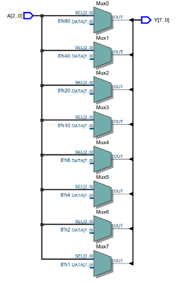
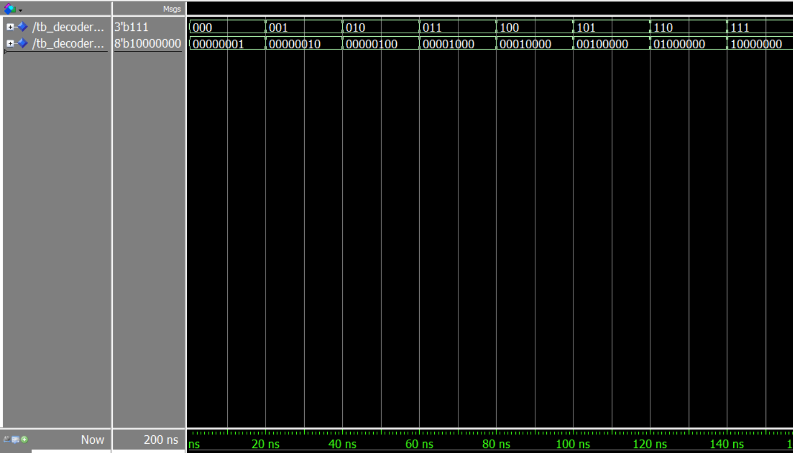
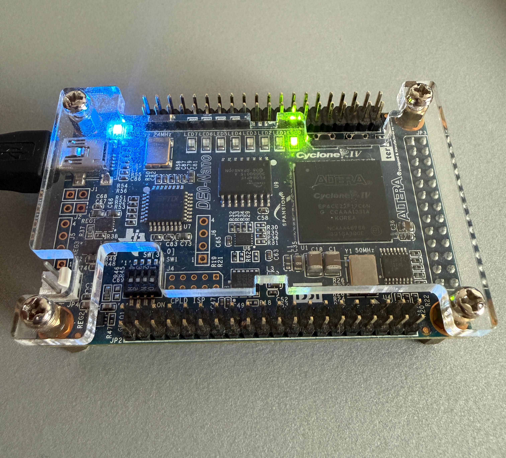
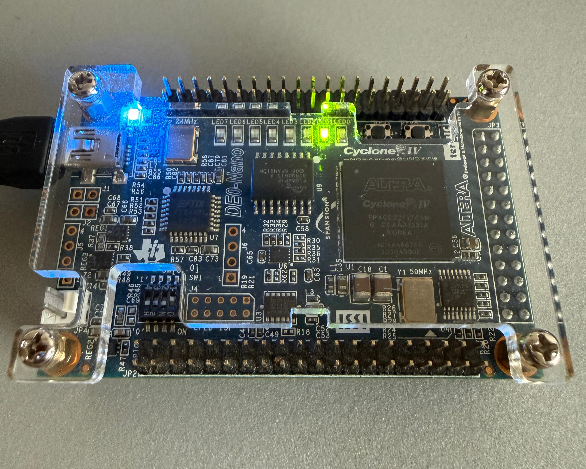
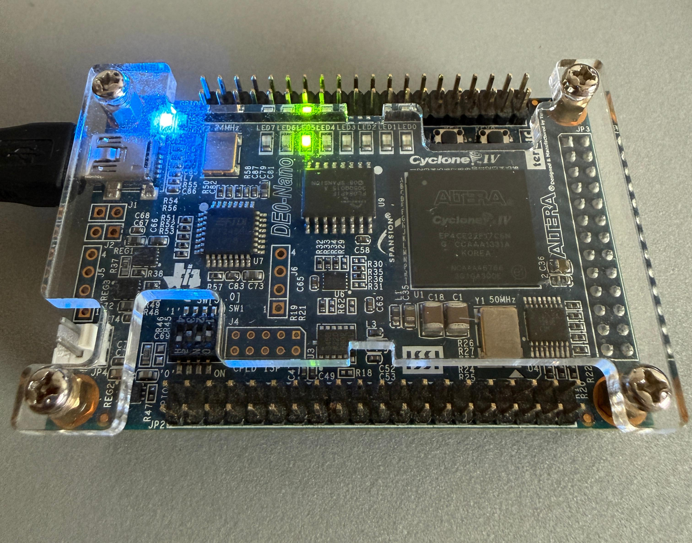
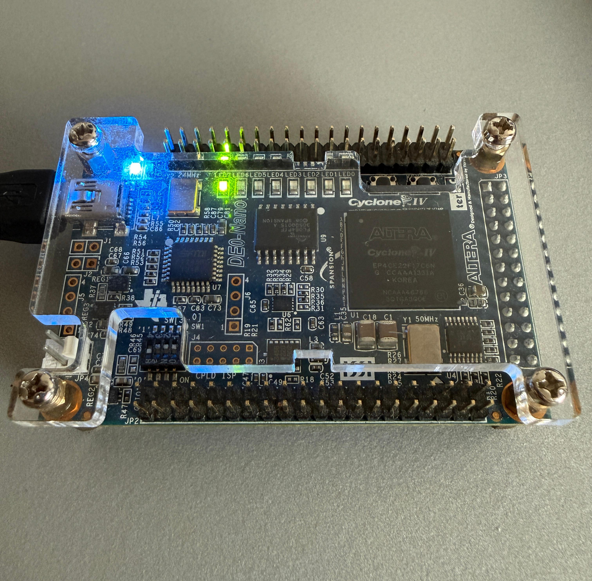

# 3-to-8 Decoder on FPGA (VHDL)

English and German documentation, VHDL design files, testbench, RTL synthesis, hardware verification, and project report for a 3-to-8 binary decoder.

---

## 📌 Project Overview / Projektübersicht

* **English:** This project implements a 3-to-8 line decoder using VHDL. It decodes a 3-bit binary input vector into an 8-bit one-hot active-high output vector. The design has been synthesized in Intel Quartus Prime, verified through simulation in QuestaSim / ModelSim, and physically validated on an FPGA development board.
* **Deutsch:** In diesem Projekt wird ein 3-zu-8-Decoder in VHDL implementiert. Er decodiert einen 3-Bit-Binäreingang in einen 8-Bit One-Hot Active-High Ausgang. Das Design wurde in Intel Quartus Prime synthetisiert, mit QuestaSim / ModelSim simuliert und auf einem FPGA-Entwicklungsboard hardwareseitig verifiziert.

---

## 📊 Truth Table / Funktionstabelle

| Input $A[2..0]$ | Output $Y[7..0]$ | Active Output Line |
| :---: | :---: | :---: |
| `000` | `00000001` | $Y_0$ |
| `001` | `00000010` | $Y_1$ |
| `010` | `00000100` | $Y_2$ |
| `011` | `00001000` | $Y_3$ |
| `100` | `00010000` | $Y_4$ |
| `101` | `00100000` | $Y_5$ |
| `110` | `01000000` | $Y_6$ |
| `111` | `10000000` | $Y_7$ |

---

## 🔧 RTL Logic Schematic / RTL-Schaltplan

The design synthesizes into parallel multiplexer stages driven by the 3-bit input bus:

  

---

## 📈 Simulation Waveform / Simulationsergebnisse

Functional verification in QuestaSim / ModelSim showing decoded one-hot states for all 3-bit input combinations ($000 \rightarrow 111$):

  

---
## 💡 Hardware Demonstration / Hardware-Verifikation

Physical testing on the FPGA board validating outputs for different input combinations:

  
  &nbsp; &nbsp;
  

  
  &nbsp; &nbsp;
  

---

## 📁 Repository Structure / Dateistruktur

* `Drei_Bit_Decoder.vhd` (or `decoder3zu8.vhd`): Synthesizable VHDL architecture and entity.
* `tb_Drei_Bit_Decoder.vhd`: Testbench stimuli for QuestaSim / ModelSim verification.
* `rtl_schematic.png`: Synthesized netlist block schematic from Quartus RTL Viewer.
* `Project_Report-3to8-Decoder .pdf`: Full project documentation and laboratory report.

---

## 📄 Full Project Report / Projektbericht

Detailed technical analysis, waveform graphs, timing verification, and pin constraints are documented in the laboratory report:

👉 [Download / View Project Report (PDF)](./Project_Report-3to8-Decoder%20.pdf)
